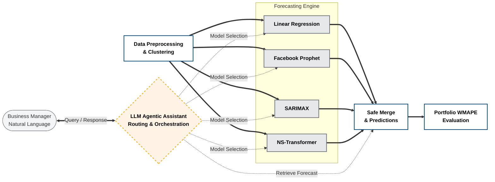

# Electricity Load Forecasting with Agentic AI


<table border="0" cellspacing="0" cellpadding="12">
<tr>
  <td align="center" width="50%">
    
  </td>
  <td align="center" width="50%">
    
  </td>
</tr>
</table>

An end-to-end, production-ready Machine Learning pipeline for forecasting short-term (day-ahead) and long-term electricity consumption across a portfolio of 370 Portuguese clients. 

This project bridges the gap between complex data science operations and business decision-making by implementing a scalable MLOps architecture, four distinct forecasting models (including a State-of-the-Art Non-Stationary Transformer), and an **LLM-based Agentic Assistant** for natural language querying.

---

## 📖 Table of Contents
- [System Architecture](#-system-architecture)
- [Key Features](#-key-features)
- [Repository Structure](#-repository-structure)
- [Getting Started](#-getting-started)
- [Usage & Pipeline Execution](#-usage--pipeline-execution)
- [The Agentic AI Layer](#-the-agentic-ai-layer)
- [Modeling Strategy](#-modeling-strategy)

---

## 🏛 System Architecture

The conceptual architecture of the system follows a strict separation of concerns, progressing from raw data ingestion to portfolio evaluation, orchestrated by an intelligent AI layer.



### Architecture Breakdown
1. **Data Preprocessing & Clustering:** Centralized ingestion that cleans data, engineers temporal/weather features, and maps clients to specific behavioral (Shape) and volume (Size) clusters.
2. **Forecasting Engine:** Four parallel modeling architectures (Linear Regression, Prophet, SARIMAX, NS-Transformer) that train dynamically based on the behavioral clusters.
3. **Safe Merge & Evaluation:** Predictions are safely un-scaled and merged back to the individual client level to calculate the Portfolio WMAPE (Weighted Mean Absolute Percentage Error).
4. **Agentic Orchestration:** An LLM-powered layer that abstracts backend complexity. It interprets business queries, selects the appropriate model artifact, executes inference, and provides analytical insights.

---

## ✨ Key Features

* **Dual-Mode Forecasting:** Supports `day_ahead` (operational spot-market trading) and `long_term` (financial hedging and budgetary planning) modes.
* **Cluster-Aware Inference:** Models are trained on aggregated behavioral clusters (K-Means) rather than 370 individual noise-heavy time series, drastically improving robustness and computational efficiency.
* **Advanced Feature Engineering:** Integrates Population-weighted Heating/Cooling Degree Hours (HDH/CDH), Weather Anomalies, recursive Autoregressive Lags (24h, 1-week), and dynamic holiday handling (accounting for the Portuguese "Troika" austerity period).
* **State-of-the-Art Deep Learning:** Implements the Non-Stationary Transformer (NeurIPS 2022) with De-stationary Attention mechanisms (`tau` and `delta` learners) using PyTorch.
* **Agentic CLI Interface:** A LangGraph/OpenAI-powered conversational agent that dynamically routes queries and interprets energy peaks.

---

## 📂 Repository Structure

To ensure scalability and maintainability, the repository follows modern MLOps best practices:

```text
forecasting-electricity/
│
├── agent/                      # Production inference layer
│   ├── artifacts/              # Serialized models, state_dicts, and scalers (*.pkl)
│   ├── inference/predict.py    # Robust PyTorch/Statsmodels inference engine
│   └── chatbot.py              # LLM conversational interface (CLI)
│
├── Datasets/                   # Raw and processed datasets
│
├── notebooks/                  # Interactive playgrounds for EDA and Benchmarking
│
├── scripts/                    # Executable automation scripts (Batch mode)
│   ├── process_data.py         # End-to-end data pipeline runner
│   └── split_and_cluster.py
│
├── src/                        # Core mathematical and utility logic (The Engine)
│   ├── models/                 # Unified API for LR, Prophet, SARIMAX, and NST
│   └── tools/                  # Data loaders, feature engineers, cleaning, evaluation
│
├── requirements.txt            # Project dependencies
└── README.md                   
```

---

## 🚀 Getting Started

### 1. Prerequisites
- Python 3.9+
- Git

### 2. Installation
Clone the repository and install the dependencies:

```bash
git clone [https://github.com/yourusername/forecasting-electricity.git](https://github.com/yourusername/forecasting-electricity.git)
cd forecasting-electricity

# Create a virtual environment (recommended)
python -m venv venv
source venv/bin/activate  # On Windows: venv\Scripts\activate

# Install dependencies
pip install -r requirements.txt
```

### 3. Environment Variables
To use the Agentic Chatbot, you need an OpenAI API key. Create a `.env` file in the root directory:

```env
OPENAI_KEY=your_openai_api_key_here
```

---

## ⚙️ Usage & Pipeline Execution

### Step 1: Data Preprocessing
Generate the ML-ready Parquet dataset. This script handles wide-to-long melting, missing value trimming, weather API fetching, lag generation, and K-Means clustering.

```bash
python scripts/process_data.py
```
*Output:* `Datasets/processed_electricity_data.parquet` (approx. 41.9M rows).

### Step 2: Train Models & Generate Artifacts
Run the desired modeling notebook or scripts. Each model implements a `save_artifacts` function that outputs the necessary `.pkl` files (scalers, regressors, and model states) into the `agent/artifacts/` directory.


### Step 3: Run the Agentic Assistant
Interact with the models via the natural language terminal interface.

```bash
python agent/chatbot.py
```

---

## 🤖 The Agentic AI Layer

The `chatbot.py` script acts as a smart orchestrator. It allows non-technical business managers to query complex models without writing code.

**Example Interaction:**


---

## 📈 Modeling Strategy

1. **Linear Regression (Baseline):** A highly interpretable autoregressive baseline utilizing dummy variables for temporal states.
2. **Facebook Prophet:** Specialized in capturing strong additive multi-seasonality (daily, weekly, yearly).
3. **SARIMAX:** A stochastic autoregressive model handling complex residuals and exogenous weather dependencies.
4. **Non-Stationary Transformer (NST):** A deep learning architecture that tackles the inherent non-stationarity of energy markets. It utilizes Projector networks (`tau` and `delta` learners) to de-stationarize the inputs before attention calculation, significantly outperforming traditional models on volatile clients.